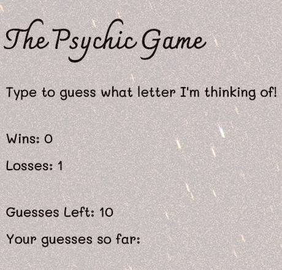

# Psychic Game (Desktop Only)

## Link to deployed app: [https://plsenh.github.io/Psychic-Game/](https://plsenh.github.io/Psychic-Game/)

---

## How to Play (Desktop Only)

In this game, a random letter is determined as the secret answer every round.

The user has up to ten tries per round to get the correct answer. A guess is made when a user types a letter.

Repeated guesses in a round will not decrease the remaining guess count.

---

## Built with:

- CSS3
- HTML5
- [JavaScript](https://developer.mozilla.org/en-US/docs/Web/JavaScript) - High-level programming language.
- [Visual Studio Code](https://code.visualstudio.com/) - Source code editor developed by Microsoft.

---

## Author:

- **Pauline Senh** - [plsenh](https://github.com/plsenh)
